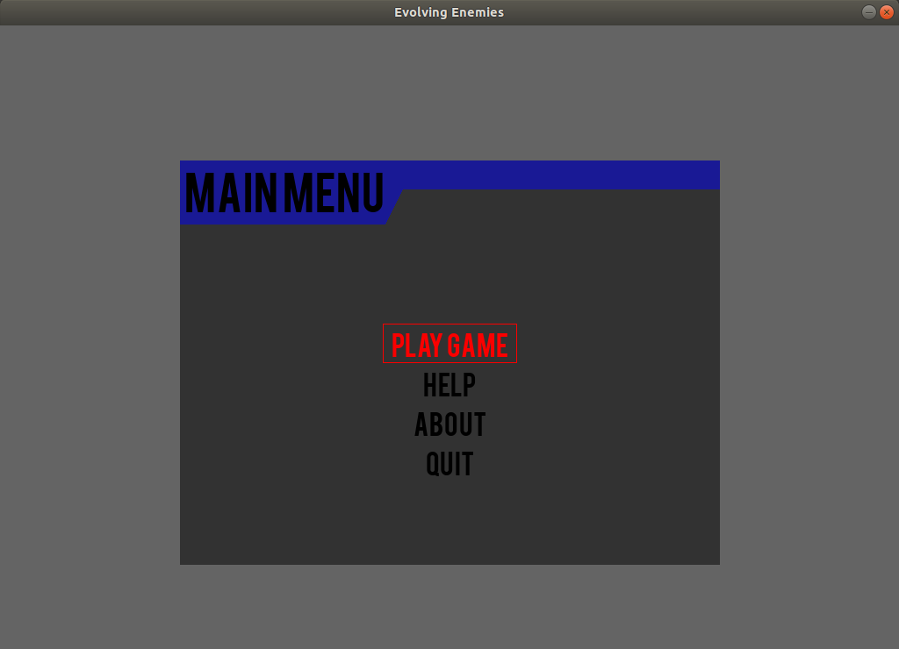

# 🧬 Evolving Enemies

## Using a Genetic Algorithm to Control Enemy Behavior in Video Games

**Evolving Enemies** is an experimental project that demonstrates how **Genetic Algorithms (GA)** can be used to control and evolve enemy behavior in a 2D video game environment.
Through principles like **Selection**, **Crossover**, and **Mutation**, enemy AI dynamically adapts over time — creating diverse, unpredictable gameplay experiences.

---

### 🎮 Concept Overview

In this simulation, each **enemy’s behavior** is encoded as a **chromosome**, which defines attributes such as movement, shooting style, and aggression level.
As the game progresses, the **Genetic Algorithm** evaluates each chromosome’s fitness and evolves the population toward more effective strategies.


<p align="center">
  
</p>

<p align="center">
  
</p>

* **Genes 0–5**: Represent binary traits (`0` = disabled, `1` = enabled).
* **Gene 6**: Represents a **fitness value** (decimal), used for selection and evolution in subsequent generations.

---

### ⚙️ Installation

#### 🧩 Dependencies

Install the required libraries using `pip`:

```bash
pip install pygame pygame-menu==1.96.1
```

---

### 🚀 How to Run

Simply execute the following command from your terminal:

```bash
python3 evolving_enemies.py
```

---

### 🕹️ Gameplay Overview

#### 🧭 Main Menu

The **Main Menu** provides navigation options for:

* **Play Menu** – Start or configure the game.
* **Help Menu** – View controls and gameplay instructions.
* **About Menu** – Learn more about the game and its creators.

<p align="center">
  
</p>

---

#### ⚙️ Play Menu

In the **Play Menu**, players can:

* **Adjust Game Difficulty** – Modifies parameters such as player and enemy firing rates.
* **Set Mutation Rate** – Controls how many genes are mutated per generation.

  * A higher mutation rate leads to greater behavioral diversity among enemies.

This allows players to experiment with the **evolutionary dynamics** and observe emergent enemy behavior patterns.

<p align="center">
  
</p>

---

#### 🧠 In-Game Example

The core gameplay demonstrates how enemies adapt across multiple episodes. As fitness evaluation and mutation occur, enemy strategies evolve — leading to new and unexpected challenges for the player.

<p align="center">
  
</p>

---

### 🧩 Technical Notes

* The game loop continuously evaluates enemy performance (fitness).
* Chromosomes evolve through selection, crossover, and mutation to produce improved enemy generations.
* Behavior diversity increases with higher mutation rates.

---

### 🧠 Future Enhancements

* Visualization of population evolution across generations.
* Adaptive difficulty scaling based on player performance.
* Integration of additional behavioral genes (e.g., evasion tactics, cooperation).

---

### 📜 License

This project is released under the **MIT License** — you are free to use, modify, and distribute it with attribution.

---

### 👨‍💻 Author

## Contact

* **Nipuna H. Weeratunge** – [GitHub](https://github.com/darkcyberwizard) | [Email](mailto:nipuna.h.weeratunge@gmail.com)

---


